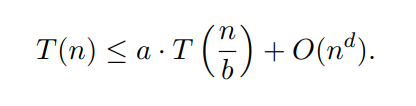
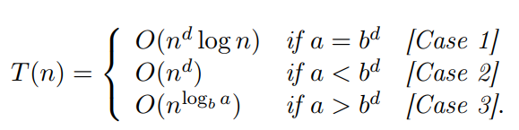

# 一. 分治算法的思想

分治（Divide-and-Conquer）的三个步骤：

- Divide：将原问题划分成问题规模更小的子问题
- Conquer：**递归**解决每个子问题
- Combine：结合子问题的答案，得到原问题的答案

# 二. 主定理 (Master Method)

主定理可以用来**分析分治算法的时间复杂度**。

假设一个分治算法**用$O(n^d)$的时间复杂度，将原问题划分成了$a$个问题规模为$\dfrac{n}{b}$的子问题**，则该算法的所耗费的时间可以表示成如下形式：

其中：

- $a$ 表示原问题划分成了几个子问题（即每次划分递归调用的个数）
- $\dfrac{n}{b}$表示每个子问题的规模
- $O(n^d)$表示**combine**步骤的时间复杂度

则**主定理的定义**如下：

这个公式有些不好记忆，而且每次都需要看着公式计算一次很麻烦，我们只需要记住**下面几个常用的结论**：

- 通过$O(1)$的时间，把规模为$n$的问题划分为**1个**规模为$\dfrac{n}{2}$的子问题，则**时间复杂度为$O(logn)$，**即：$T(n) = T(\dfrac{n}{2}) + O(1) = O(logn)$
  - 例如二分搜索
- 通过$O(1)$的时间，把规模为$n$的问题划分为**2个**规模为$\dfrac{n}{2}$的子问题，则**时间复杂度为$O( n)$，**即：$T(n) = 2T(\dfrac{n}{2}) + O(1) = O(n)$
- 通过$O(n)$的时间，把规模为$n$的问题划分为**2个**规模为$\dfrac{n}{2}$的子问题，则**时间复杂度为$O( nlogn)$，**即：$T(n) = 2T(\dfrac{n}{2}) + O(n) = O(nlogn)$
  - 例子：
    - 归并排序
    - 快速排序的每次枢轴都恰好在重点的特殊情况