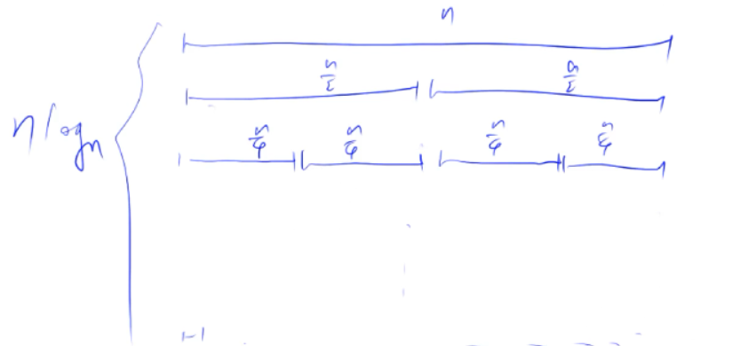

#  一. 快速排序


快速排序是基于**分治**的思想，其步骤如下：

1.**确定分界点(即枢轴pivot)**：分界点可以是数组内任意一个元素$x$，例如$q[l], q[r], q[\dfrac{l+r}{2}]$等等

2.**调整区间**：我们需要将区间调整为上图所示的形式，左半部分都小于等于x，右半部分都大于等于x。

- 注意：枢轴元素$x$不一定就在上图所示的分界点上

3.**递归的处理左右两段**


## # 如何调整区间?

快排算法的核心是如何调整区间，使得区间分为两半部分，左半部分都小于等于枢轴元素，右半部分都大于等于枢轴元素。

### **方法一**

假设待排序数组为$num[]$

引入两个额外的数组$a[], b[]$

- 选取$num[ l]$为枢轴$x$
- 遍历数组$num$，将**小于等于**$x$的元素记录在$a$；将**大于**$x$的元素记录在$b$
- 遍历完成后，修改原数组$num$，使其左半部分是$a$，右半部分是$b$

### 方法二：双指针法

假设当前要处理的区间范围是$[l,\ r]$，选取枢轴元素为$x$。

设置两个指针 $i$ 和 $j$，分别指向当前区间的位置和终止位置。

1.指针$i$先往右移动，直到找到第一个**大于等于**$x$的元素，停止。

2.然后指针$j$往左移动，直到找到第一个**小于等于**$x$的元素，停止。

3.交换$i, \ j$指向的值，$i$向右移动一格，$j$向左移动一格

4.重复步骤1，直到i>=j。

- 最终可以选择以$j$为分界点递归：$[l,\ j]$ 和$[j + 1, r]$
- 也可以选择以$i$分界点递归：

> :warning: 注意：上面流程中的步骤1，需要找**大于等于**$x$的元素，而不能是**大于**$x$的元素​，因为如果找大于$x$的元素可能越界（考虑数组中元素全都等于$x$的情况）。
>
> 同理，步骤2中也不能是**小于**。

显然，通过两个指针的配合，在任意时刻，我们都确保了$i$左侧的元素都小于等于$x$，$i$右侧的元素都大于等于$x$。同理，对于$j$，$j$右侧的元素都大于等于$x$，$j$左侧的元素都小于等于$x$。

### 方法三: 单指针法

设置一个指针`pivotIndex`, 记录**小于等于枢轴的最后一个元素的后一个位置**（也可以记录**小于枢轴的最后一个元素的后一个位置**）。 

假设选取区间右端点作为枢轴元素，`pivotIndex`一开始指向区间左端点`l`，从`[l, r - 1]`循环，每次遇到小于等于枢轴的元素，就把该元素和`pivotIndex`处的元素交换，然后`pivotIndex++`。

这样，**在循环的过程中，可以始终确保`pivotIndex`左边的元素都小于等于枢轴元素**，最后仍然可以把原区间分为两部分，一部分都小于等于枢轴，另一部分都大于枢轴，且`pivotIndex`的位置即枢轴应该放置的位置。

## # 代码模板

### 双指针

> https://www.acwing.com/problem/content/787/

```java
public void quickSort(int[] num, int l, int r) {
    if (l >= r)  return; // (1) 

    int pivot = num[l];
    int i = l - 1, j = r + 1;
    while (i < j) {
        do {i++;} while(num[i] < pivot);
        do {j--;} while(num[j] > pivot);
        if (i < j) swap(num, i, j); // 
    }
    
    // (2)
    quickSort(num, l, j); 
    quickSort(num, j+1, r);
}
```

模板说明：

- i取l-1, j取r+1的原因：每次循环都是先移动指针，再判断，这样可以**避免我们swap之后再次移动指针的必要**
- 注意，上述模板中，枢轴**不能取右边界点**。

**:star::star: 有如下重要结论**

- 每轮排序后，$i$左侧的元素都小于等于$x$，$i$右侧的元素都大于等于$x$;  $j$右侧的元素都大于等于$x$，$j$左侧的元素都小于等于$x$。
- 每轮排序后，(2)处**要么i == j**，**要么j == i - 1**
  - i == j的情况，5 3 1且3为枢轴
  - j == i - 1的情况，5 3 3 1且3为枢轴

- 每轮排序开始之前，(1)处

  - **只有数组长度为0时，才可能有l > r**；此时l == 0, r== -1
  -  若数组长度不为0，**l一定小于等于r，l不可能大于r**，换句话说，递归到最深层时区间长度为1，而不可能是负的。

  因此，不直接写成l == r是包含了数组长度为0的特殊情况。

```java
// 另一种写法
public void quickSort(int[] num, int l, int r) {
    if (l >= r)  return;

    int pivot = num[r];
    int i = l - 1, j = r + 1;
    while (i < j) {
        do {i++;} while(num[i] < pivot);
        do {j--;} while(num[j] > pivot);
        if (i < j) swap(num, i, j);
    }

    quickSort(num, l, i - 1);
    quickSort(num, i, r);
}
```

模板说明：

- 上述模板中，相当于把第一个模板最后两行的j换成了i，然后再减1
- 不过此时的pivot不能取左边界点

### 单指针

```java
public void quickSort(int[] nums, int l, int r) {
    if (l >= r) return;

    int pivotIndex = partition(nums, l, r);
    quickSort(nums, l, pivotIndex - 1);
    quickSort(nums, pivotIndex + 1, r);
}

private int partition(int[] nums, int l, int r) {
    int chosenIndex = l + random.nextInt(r - l + 1);
    int pivot = nums[chosenIndex];
    swap(nums, chosenIndex, r); // 别忘了换到最后
    int pivotIndex = l;

    for (int i = l; i < r; ++i) {
        if (nums[i] < pivot) swap(nums, i, pivotIndex++);
    }
    swap(nums, pivotIndex, r);
    return pivotIndex;
}
```

上述代码中：

- (1) 处**`l-r`** 的可能为`0`，也可能为`1`
- (2) 处也可以写成`<`

# 二. 归并排序


归并排序仍然是基于**分治**的思想，其步骤如下：

1.确定分界点**界点固定取$l + (r - l) / 2$

2.递归对左右两部分进行排序

3.合并左右两部分


## # 图解时间复杂度



## # 代码模板

> https://www.acwing.com/problem/content/789/

```java
private void mergeSort(int[] num, int l, int r) {
    if (l >= r)  return; // (1) 

    int mid = l + (r - l) / 2;
    mergeSort(num, l, mid);
    mergeSort(num, mid + 1, r);

    // ★ 开一个辅助数组
    int[] tmp = new int[r - l + 1];
    int k = 0, i = l, j = mid + 1;
    while (i <= mid && j <= r) {
        if (num[i] <= num[j]) {tmp[k++] = num[i++];}
        else {tmp[k++] = num[j++];}
    }
    while (i <= mid) {tmp[k++] = num[i++];}
    while (j <= r) {tmp[k++] = num[j++];}

    for (i = l, j = 0; i <= r; ++i,++j) {num[i] = tmp[j];}
}
```

:warning: **重要结论**：​

上述代码的(1)处

- **只有数组长度为0时，才可能有l > r**；此时l == 0, r== -1
-  若数组长度不为0，**l一定小于等于r，l不可能大于r**，

因此，不直接写成l == r是包含了数组长度为0的特殊情况。

# 三. 二分查找

> https://www.acwing.com/blog/content/31/

## 1. 整数二分

### 代码模板

#### 模板1

> https://www.evernote.com/l/Aq43TSOPWHFLwL2K_OtlxdwhepsLf8hr-IM/

大部分情况下，还是用九章算法的模板比较好

```java
int binarySearch(int[] nums, int target) {
    if (nums == null || nums.length == 0) return -1;

    int l = 0, r = nums.length - 1;
    while (l + 1 < r) { // (1)
        int mid = l + (r - l) / 2;
        if (nums[mid] == target) {
            return mid;
        } else if (nums[mid] < target) {
            l = mid; // (2) 为什么这样写？为了防止死循环！！！
        } else {
            r = mid - 1;
        }
    }
	
    // (2)
    if (nums[l] == target)  return l;
    if (nums[r] == target)  return r;
    return -1;
}
```

关于上述模板的几点说明：

- 循环的条件是`l + 1 < r` 可以**防止死循环和溢出现象**的发生。也没必要太纠结原因，这是前人总结出来的结论。

- 因为我们的循环条件是`l + 1 < r`，所以`mid`一定在`l`和`r`之间，而不可能等于`l`或`r`，这也确保了`mid+1`和`mid-1`**不会产生越界错误**

- 因为我们的循环条件是`l + 1 < r`，因此<u>如果数组长度不是1的话</u>，循环结束后在(2)处有`l+1 == r`，我们**还需要额外判断一下`l`和`r`这两处是不是满足指定条件**。

  - 如果数组长度等于1，那么**`while`循环一次也不会被执行**，所以在(2)处有`l == r`

- :star: **该模板需要注意一个坑，也就是(2)处**。之所以写`l = mid`而不写`l = mid + 1`是为了防止整数溢出造成死循环，考虑下面的情况：

  ```java
  l = Integer.MAX_VALUE - 2, r = Integer.MAX_VALUE;
  // 则本次循环
  mid = Integer.MAX_VALUE - 1;
  // 如果本次循环仍有target > nums[mid]的话, 那么本轮循环会修改l为
  l = mid + 1 = Integer.MAX_VALUE;
  
  // 这样的话，在while循环的条件处 l + 1 就会溢出!!! 变成负数!!! 从而陷入死循环!!!
  ```

  因此，一定不能写`l = mid + 1`！！！

#### 模板2

```java
// 该模板在区间[l, r]被划分成[l, mid]和[mid + 1, r]时使用
// 典型的应用就是"求满足xxx的第一个元素"
int binarySearch(int[] nums, int l, int r) {
    while (l < r) {
        int mid = l + (r - l) / 2;
        if (check(mid)) r = mid;
        else l = mid + 1;
    }
    
    return l;
}

// 或

// 该模板在区间[l, r]被划分成[l, mid - 1]和[mid, r]时使用
// 典型的应用就是"求满足xxx的最后一

个元素"
int binarySearch(int[] nums, int l, int r) {
    while (l < r) {
        int mid = l + (r - l + 1) / 2;
        if (check(mid)) l = mid;
        else r = mid - 1;
    }
    
    return l;
}
```


### 应用

#### (1) 求第一个/最后一个满足xxx条件的元素或下标

##### 题目1： 数组中指定元素第一次出现和最后一次出现的下标

> https://www.acwing.com/problem/content/791/
>
> 给定一个按照升序排列的长度为n的整数数组，以及 q 个查询。
>
> 对于每个查询，返回一个元素k的起始位置和终止位置（位置从0开始计数）。
>
> 如果数组中不存在该元素，则返回“-1 -1”。
>
> #### 输入格式
>
> 第一行包含整数n和q，表示数组长度和询问个数。
>
> 第二行包含n个整数（均在1~10000范围内），表示完整数组。
>
> 接下来q行，每行包含一个整数k，表示一个询问元素。
>
> #### 输出格式
>
> 共q行，每行包含两个整数，表示所求元素的起始位置和终止位置。
>
> 如果数组中不存在该元素，则返回“-1 -1”。
>
> #### 数据范围
>
> 1≤n≤1000001≤n≤100000
> 1≤q≤100001≤q≤10000
> 1≤k≤100001≤k≤10000
>
> #### 输入样例：
>
> ```
> 6 3
> 1 2 2 3 3 4
> 3
> 4
> 5
> ```
>
> #### 输出样例：
>
> ```
> 3 4
> 5 5
> -1 -1
> ```

```java
import java.util.Scanner;

public class Main {
    public static void main(String[] args) {
        Scanner sc = new Scanner(System.in);
        int n = sc.nextInt();
        int q = sc.nextInt();
        int[] nums = new int[n];
        
        for (int i = 0; i < n; ++i) nums[i] = sc.nextInt();
        
        for (int i = 0; i < q; ++i) {
            int k = sc.nextInt();
            int firstIdx = firstIndex(nums, k);
            int lastIdx = firstIdx == -1 ? -1 : lastIndex(nums, k);
            System.out.printf("%d %d\n", firstIdx, lastIdx);
        }
    }
    
    private static int firstIndex(int[] nums, int target) {
        int l = 0, r = nums.length - 1;
        while (l + 1 < r) {
            int mid = l + ((r - l) >>> 1);
            if (nums[mid] == target) r = mid;
            else if (nums[mid] < target) l = mid + 1;
            else r = mid - 1;
        }
        
        if (nums[l] == target)  return l;
        if (nums[r] == target)  return r;
        return -1;
    }
    
    private static int lastIndex(int[] nums, int target) {
        int l = 0, r = nums.length - 1;
        while (l + 1 < r) {
            int mid = l + ((r - l) >>> 1);
            if (nums[mid] == target) l = mid;
            else if (nums[mid] < target) l = mid + 1;
            else r = mid - 1;
        }
        
        if (nums[r] == target)  return r;
        if (nums[l] == target)  return l;
        return -1;
    }
}
```

##### 题目2: 第一个错误版本

:star: 当使用二分法时，我们**不能仅仅将二分法的适用对象局限于排好序的数组**，​我们应该有如下的思维：


假设数组的**前半部分都满足一个性质**，**后半部分都满足另一个性质**，让我们寻找第一个或最后一个满足某性质的元素或下标，我们都可以使用二分法的思想。

---------

下面这个题目就是一个典型的例子：

> #### [278. 第一个错误的版本](https://leetcode-cn.com/problems/first-bad-version/)
>
> 难度简单164
>
> 你是产品经理，目前正在带领一个团队开发新的产品。不幸的是，你的产品的最新版本没有通过质量检测。由于每个版本都是基于之前的版本开发的，所以错误的版本之后的所有版本都是错的。
>
> 假设你有 `n` 个版本 `[1, 2, ..., n]`，你想找出导致之后所有版本出错的第一个错误的版本。
>
> 你可以通过调用 `bool isBadVersion(version)` 接口来判断版本号 `version` 是否在单元测试中出错。实现一个函数来查找第一个错误的版本。你应该尽量减少对调用 API 的次数。
>
> **示例:**
>
> ```
> 给定 n = 5，并且 version = 4 是第一个错误的版本。
> 
> 调用 isBadVersion(3) -> false
> 调用 isBadVersion(5) -> true
> 调用 isBadVersion(4) -> true
> 
> 所以，4 是第一个错误的版本。 
> ```

该题目中`OOO`就相当于`Good Version`，`XXX`就相当于`Bad Version`，让我们找到第一个错误版本，因此可以使用二分法：

```java
public class Solution extends VersionControl {
    public int firstBadVersion(int n) {
        if (n == 0) return -1;

        int l = 1, r = n;
        while (l + 1 < r) {
            int mid = l + ((r - l) >>> 1);
            if (isBadVersion(mid)) r = mid;
            else l = mid; // 特别注意: 不能写l = mid + 1
        }

        if (isBadVersion(l)) return l;
        if (isBadVersion(r)) return r;
        return -1;
    }
}
```

##### 题目3: 旋转数组的最小值

> #### [153. 寻找旋转排序数组中的最小值](https://leetcode-cn.com/problems/find-minimum-in-rotated-sorted-array/)
>
> 难度中等185
>
> 假设按照升序排序的数组在预先未知的某个点上进行了旋转。
>
> ( 例如，数组 `[0,1,2,4,5,6,7]` 可能变为 `[4,5,6,7,0,1,2]` )。
>
> 请找出其中最小的元素。
>
> 你可以假设数组中不存在重复元素。
>
> **示例 1:**
>
> ```
> 输入: [3,4,5,1,2]
> 输出: 1
> ```
>
> **示例 2:**
>
> ```
> 输入: [4,5,6,7,0,1,2]
> 输出: 0
> ```

```java
class Solution {
     public int findMin(int[] nums) {
        if (nums == null || nums.length == 0)  return -1;
        if (nums[0] <= nums[nums.length - 1]) return nums[0];

        int l = 0, r = nums.length - 1;
        while (l + 1 < r) {
            int mid = l + (r - l) / 2;
            if (nums[mid] < nums[0]) r = mid;
            else l = mid;
        }

        return Math.min(nums[l], nums[r]);
    }
}
```

##### 题目4:  搜索旋转数组

> #### [33. 搜索旋转排序数组](https://leetcode-cn.com/problems/search-in-rotated-sorted-array/)
>
> 难度中等736
>
> 假设按照升序排序的数组在预先未知的某个点上进行了旋转。
>
> ( 例如，数组 `[0,1,2,4,5,6,7]` 可能变为 `[4,5,6,7,0,1,2]` )。
>
> 搜索一个给定的目标值，如果数组中存在这个目标值，则返回它的索引，否则返回 `-1` 。
>
> 你可以假设数组中不存在重复的元素。
>
> 你的算法时间复杂度必须是 *O*(log *n*) 级别。
>
> **示例 1:**
>
> ```
> 输入: nums = [4,5,6,7,0,1,2], target = 0
> 输出: 4
> ```
>
> **示例 2:**
>
> ```
> 输入: nums = [4,5,6,7,0,1,2], target = 3
> 输出: -1
> ```

```java
class Solution {
    public int search(int[] nums, int target) {
        if (nums == null || nums.length == 0) return -1;

        int l = 0, r = nums.length - 1;
        while (l + 1 < r) {
            int mid = l + (r - l) / 2;
            if (nums[mid] == target) {
                return mid;
            } else if (nums[mid] > nums[0]) {
                if (target < nums[mid] && target >= nums[0]) r = mid;
                else l = mid;
            } else {
                if (target > nums[mid] && target < nums[0]) l = mid;
                else r = mid;
            }
        }

        if (nums[l] == target) return l;
        if (nums[r] == target) return r;
        return -1;
    }
}
```

可能有两种情况：

- 数组发生了旋转
- 数组根本就没旋转

<u>**对于数据发生旋转的情况**</u>

当`nums[mid] > nums[0]`时，说明`mid`落在左上升区间，此时`target`可能有如下情况：

- `target < nums[mid]`，`target`可能落在左区间(1)，也可能落在右区间(2)
- `target > nums[mid]`，`target`落在左区间(3)

结合图形可以更直观的分析出来，只有当`target < nums[mid] 且 target >= nums[0]`时才修改`r = mid`，其余情况修改`l = mid`。

<u>**对于数据没发生旋转的情况**</u>

此时若`nums[mid] != target`，则一定有`nums[mid] > nums[0]`。

一种情况：`target < nums[mid]`，此时必有`target >= nums[0]`, 必定修改`r = mid`

另一种情况：`target > nums[mid]`，此时必定修改`l = mid`

> 注：上述`else if `语句也可以以`nums[mid] ? target`为条件，然后进一步分情况讨论

-----------------------------

# 总结

快速排序、归并排序和二分的思想都类似，**将所求问题转化为子区间上的问题**，**缩小区间**是一个关键技巧。

其中，在某些快速排序、归并排序、二分思想的应用中，**我们始终确保答案在我们缩小后的区间内，当最终区间只剩一个元素时，就是我们要求的解**。

