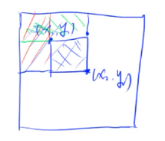
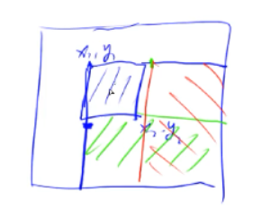

> **前缀和** 和 **差分** 互为逆运算，它们都适合与**区间操作**。
>
> **前缀和** 适合于区间查询。 
>
> **差分** 适合于区间修改（对区间内的每个数都加上或减去一个数）。

# 一. 前缀和

## 1. 一维前缀和

> **问题**
>
> 输入一个长度为 $n$ 的整数数组。
>
> 进行 $k$ 次查询，每次查询该数组 第 $l$ 个元素 到 第 $r$ 个元素这个区间上的元素之和 (闭区间)。
>
> 其中 $1 \le l, r \le n$
>
> :warning: 注意：$l$ 和 $r$ 的下标从1开始​

假设输入的数组为 $a_1, a_2, ..., a_n$，则**前 $i$ 项的前缀和**为 $S_i = a_1 + a_2 + ... + a_i$。

注意：前缀和模板中，下标从1开始，我们规定 $S_0 = 0$

**如何求前缀和？**

给定一个数组，求前 $i$ 项的前缀和 $S_i$，我们没必要从第1项累加到第i项，而是可以**借助前一项进行递推**：

```java
for (int i = 1; i <= n; ++i)
    S[i] = S[i - 1] + a[i];
```

**前缀和有什么用？**

适合于**求一段<u>区间</u>的<u>元素和</u>**的问题，例如：

- 前 $i$ 个元素的和：$S _i$

- 第 $l$ 到 $r$ 个元素区间内的和（闭区间）：$S_r - S_{l-1}$
  $S_r - S_{l-1} = (a_1 + a_2 + ... + a_l + a_{l+1} + ... + a_{r}) - (a_1 + a_2 + ... + a_{l-1}) = a_l + a_{l+1} + ... + a_{r}$

### 代码模板

```java
/**
 * n: 数组长度
 * k: k次查询
 * l, r: 区间左右端点
 */
public class PrefixSum {
    public static void main(String[] args) {
        Scanner sc = new Scanner(System.in);
        int n = sc.nextInt();
        int k = sc.nextInt();
        // 前缀和下标从1开始 (1~n), 规定S0 = 0
        int[] a = new int[n + 1];
        int[] S = new int[n + 1];

        // 输入元素, 同时求前缀和 O(n)
        for (int i = 1; i <= n; ++i) {
            a[i] = sc.nextInt();
            S[i] = S[i - 1] + a[i];
        }

        // 区间和查询 O(k)
        for (int i = 0; i < k; i++) {
            int l = sc.nextInt();
            int r = sc.nextInt();
            System.out.println(S[r] - S[l - 1]);
        }
    }
}
```

### 时间复杂度

**O(n)**

一般来说，查询次数 $k$ 远小于数组长度 $n$，我们得到前缀和数组后，每次查询只消耗 $O(1)$的时间复杂度，所以总的时间复杂度为 $O(n)$。

---------

如果<u>不采用前缀和数组</u>，时间复杂度是多少呢？最差情况下每次都要遍历整个数组，所以时间复杂度为 $O(kn)$。

## 2. 二维前缀和

输入输一个 $m × n$ 的矩阵（输入元素的下标从1开始，但是我们还给它不上下标0，为默认值0），假设每个元素的坐标为 $(i, j)$

| (0,0)     | (0,1) | (0,2) | ...  | (0,n) |
| --------- | ----- | ----- | ---- | ----- |
| **(1,0)** | (1,1) | (1,2) | ...  | (1,n) |
| **(2,0)** | (2,1) | (2,2) | ...  | (2,n) |
| **(3,0)** | (3,1) | (3,2) | ...  | (3,n) |
| **...**   | ...   | ...   | ...  | ...   |
| **(m,0)** | (m,1) | (m,2) | ...  | (m,n) |



对于坐标 $(i,j)$ 处的**前缀和 $S_{i,j}$定义**如下：**行坐标小于等于 $i$， 列坐标小于等于 $j$ 的所有元素之和**。我们可以使用递推公式求 $S_{i,j}$：

$S_{i,j} = S_{i,j-1} + S_{i-1,j} - S_{i-1,j-1} + a_{i,j}$

> 注意：$i$ 或 $j$ 为0的坐标其前缀和都是0

给定一个矩形区域的左上点和右下点 $(x_1, y_1)$ 和 $(x_2, y_2)$，$x_1 \le x_2,\  y_1\le y_2$，它们确定一个矩形区域，**这个矩形区域内的元素和可以用如下公式求解**：

$S = S_{x_2,y_2} - S_{x_2, y_1-1} - S_{x_1-1, y_2} + S_{x_1-1, y_1-1}$

> 注：即使给定的两个点不是左上和右下的关系，也可以求出对应矩形区域的左上点和右下点，进而用上述方法进行求解。

### 代码模板

```java
/**
 * 二维矩阵前缀和
 * <p>
 * m, n: 输入m × n的矩阵
 * k: k次查询, 每次一次输入左上角点和右下角点, 查询这两个点对应的矩形范围内的元素和
 */
public class PrefixSum2D {
    public static void main(String[] args) {
        Scanner sc = new Scanner(System.in);
        int m, n, k;
        m = sc.nextInt();
        n = sc.nextInt();
        k = sc.nextInt();
        // 输入元素对应的(i,j)下标均从1开始
        int[][] a = new int[m + 1][n + 1];
        int[][] S = new int[m + 1][n + 1];

        // 输入矩阵元素
        for (int i = 1; i <= m; i++) {
            for (int j = 1; j <= n; j++) {
                a[i][j] = sc.nextInt();
            }
        }

        // 求每个坐标对应的前缀和
        for (int i = 1; i <= m; ++i) {
            for (int j = 1; j <= n; ++j) {
                S[i][j] = S[i][j - 1] + S[i - 1][j] - S[i - 1][j - 1] + a[i][j];
            }
        }

        // k次查询
        for (int i = 0; i < k; i++) {
            int x1, y1, x2, y2; // 左上点和右下点
            x1 = sc.nextInt();
            y1 = sc.nextInt();
            x2 = sc.nextInt();
            y2 = sc.nextInt();

            int s = S[x2][y2] - S[x2][y1 - 1] - S[x1 - 1][y2] + S[x1 - 1][y1 - 1];
            System.out.println(s);
        }

        sc.close();
    }
}
```

### 时间复杂度

**O(mn)**

假设查询次数k远小于m和n，则时间复杂度为O(mn)。

------

如果不采用前缀和，则时间复杂度为O(kmn)。

# 二. 差分

差分和前缀和**互为逆运算**，根据前面求前缀和的公式我们即可得出求差分的公式！！！

## 1. 一维差分

差分是前缀和的逆运算。

在差分问题中，给定我们一个数组$S_1, S_2, ..., S_n$，**构造一个数组** $a_1, a_2, ..., a_n$，使得数组 $S$ 是数组 $a$ 的前缀和，即：$S_i = a_1 + a_2 + ... + a_i$。则数组 $a$ 称作数组 $S$ 的**差分**，数组 $S$ 是数组 $a$ 的前缀和。


### **如何构造数组$a$？**

:arrow_right: 构造数组 $a$ 最简单的一种方法就是，令：

- $ a_1 = S_1$
- $a_2 = S_2 - S_1$
- $a_3 = S_3 - S_2$
- ...
- $a_n = S_n - S_{n-1}$

### **差分运算有什么用处？**

:star::star::star:

**总结**：差分适合于这样的若干次**区间操作**，每次都**对区间内的元素加上/减去一个指定的数**。

差分可以将上述的每次区间修改操作的**时间复杂度降低到 $O(1)$ 级别**。

:star::star::star:

------------------

下面结合一个问题来理解：

> 输入一个长度为 $n$ 的整数序列。
>
> 接下来输入 $m$ 个操作，每个操作包含3个整数 $l, r, c$，表示将$[l, r]$ 区间内的每个元素都加上 $c$。
>
> 请你输出执行完所有这 $m$ 个操作后的序列。
>
> 
>
> **数据范围**
>
> $1 \le n,m \le 100,000$
>
> $1\le l\le r \le n$
>
> $-1000\le c,数组中的元素值 \le 1000$ 

对于这道题目，如果进行 $m$ 次循环，每次循环都遍历整数序列进行修改的话，需要处理的数据量上限达到了 $10^{10}$，**有可能会超时**。

借助差分算法，我们可以把时间复杂度由$O(m\cdot n)$降到 $O(n)$ 级别，**思路如下**：

假设输入的整数序列为 $a$，其对应的差分数组之一为 $b$。（换句话说，数组 $a$ 是数组 $b$ 的前缀和）

从之前的讨论中我们知道，差分数组和前缀和之前很容易就能互求：

- 知道一个数组 $x$ 我们很容易就能在 $O(n)$ 的时间复杂度内求出它的前缀和数组 $S$

  ```java
  for (int i = 1; i <= n; ++i) {
      S[i] = S[i - 1] + x[i];
  }
  
  ```

- 知道一个数组 $S$ 我们也能很容易的在 $O(n)$ 的时间复杂度内求出它的差分数组

对原数组 $a$ 的区间 $[l, r]$ 上的所有元素都加 $c$（原数组可以看做是一个**前缀和数组**） ，这个$O(n)$级别的运算**可以转换为差分数组上$O(1)$级别的运算**，怎么转换呢？

上述操作就**等价于差分数组 $b$ 的 $b_l + c, b_{r+1} - c$**，我们可以对差分数组进行操作，最后从差分数组求出原数组，从而将上述 $m$ 次区间操作的时间复杂度由降低到 $O(m + n)$ 级别。

>  举个例子，假设输入的数组`a`为`1 5 10 6 7`
>
> 我们想对区间`[1,3]`上的元素都加上`5`，一种暴力的做法就是遍历数组`[1, 3]`下标的区间，修改原数组，都加上`5`。
>
> 还有一种做法，就是借助差分。数组`a`一定对应一个差分数组`b`，`b`的值并不重要，我们重点关注它和原数组`a`的对应关系。假设数组$b$为$b_0, b_1, b_2, b_3, b_4$。**我们对 $b_1$ 加上`5`，对 $b_4$减去`5`，那么再次根据数组$b$计算出的原数组`a`就是区间`[1,3]`都加上5的数组。**

#### 模板1：

```java
/**
 * 问题描述见 "04.前缀和-差分.md"
 * <p>
 * n: 输入数组长度
 * m: m次区间修改
 * l, r: 区间端点 (包含)
 * c: 区间[l, r]内元素加上的值
 */
public class Diff {
    public static void main(String[] args) {
        Scanner sc = new Scanner(System.in);
        int n = sc.nextInt();
        int m = sc.nextInt();

        // 1. 输入数组
        // 和前缀和运算保持一致, 输入元素下标从1开始
        int[] a = new int[n + 1]; // 在该问题中, a相当于前缀和数组
        for (int i = 1; i <= n; i++) {
            a[i] = sc.nextInt();
        }

        // 2. 构造对应的差分数组b
        int[] b = new int[n + 1];
        for (int i = 1; i <= n; i++) {
            b[i] = a[i] - a[i - 1];
        }

        // 3. m次区间操作 --> 转化为对差分数组的m次操作
        for (int i = 0; i < m; i++) {
            int l, r, c;
            l = sc.nextInt();
            r = sc.nextInt();
            c = sc.nextInt();
            b[l] += c;
            if (r < n) b[r + 1] -= c;
        }

        // 4. m次操作完成, 根据差分数组修改原数组, 得到结果
        for (int i = 1; i <= n; i++) {
            a[i] = a[i - 1] + b[i];
        }
    }
}

```

其实，上述代码可以进一步精简，参见模板2

#### 模板2：把数据输入步骤也看做对差分数组的修改

在模板1中，一开始我们有一个**元素全是0**的数组`a[n+1]`：

```java
Scanner sc = new Scanner(System.in);
int n = sc.nextInt();
int m = sc.nextInt();

int[] a = new int[n + 1]; // 元素全0的数组
```

上述的`a`是**差分数组**，因为**它的元素全是0，所以它对应的前缀和数组元素也全是0**。

-------------------------------

下面，开始对这个元素全0的差分数组进行两步操作

**(1)** **读取输入赋值给原数组`b`的每个元素**

该操作也可以转化为:white_check_mark:**对差分数组`a`的区间操作**，读取并给`b[i]`赋值，就等价于对**差分数组**`[i, i]`区间上的元素加上`b[i]`。**这和后面的m次区间操作是同一种操作**，可以抽象出如下共同的逻辑：

```java
private static void manipulate(int[] a, int l, int r, int c) {
    a[l] += c;
    if (r < a.length - 1) a[r + 1] -= c;
}
```

**(2)** m次区间操作，也是套用上述`manipulate()`方法的逻辑


```java
public class Diff2 {
    private static void manipulate(int[] a, int l, int r, int c) {
        a[l] += c;
        if (r < a.length - 1) a[r + 1] -= c;
    }

    public static void main(String[] args) {
        Scanner sc = new Scanner(System.in);
        int n = sc.nextInt();
        int m = sc.nextInt();

        // 1. 将原数组的初始化 转化为 对差分数组的区间操作
        // 这里, a是差分数组
        int[] a = new int[n + 1];
        for (int i = 1; i <= n; i++) {
            manipulate(a, i, i, sc.nextInt());
        }

        // 2. m次区间操作
        for (int i = 0; i < m; i++) {
            int l, r, c;
            l = sc.nextInt();
            r = sc.nextInt();
            c = sc.nextInt();
            manipulate(a, l, r, c);
        }

        // 3. 直接在数组a上修改，得到修改后的原数组
        for (int i = 1; i <= n; ++i) {
            a[i] += a[i - 1];
        }

        // 等价于
        /*int[] b = new int[n + 1];
        for (int i = 1; i <= n; i++) {
            b[i] = b[i - 1] + a[i];
        }*/
    }
}
```

可以看到，正是由于给数组赋值和区间操作**可以统一为对差分数组的操作**，我们**甚至没有必要声明原数组**，**只对差分数组进行修改，最后由差分数组得到原数组即可**。

#### 时间复杂度

**O(m + n)**

## 2. 二维差分

和一维差分的题目类似，给定一个 $m × n$ 的二维矩阵，我们执行 $k$ 次操作，每次给定一个矩形区域的左上角点和右下角点，对这个矩形区域内的元素都加上 $c$。

最后输出 $k$ 次操作后的矩阵。

### 思路分析



如图所示，给定矩阵`A`，左上点为 $(x_1, y_1)$，右下点为 $(x_2, y_2)$，要求我们对这两个点构成的矩形区域内的元素都加上`c`。

假设矩阵`A`的差分矩阵为`B`，那么对差分矩阵 $ (i,j)$ 处的元素加上 $c$就等价于原矩阵 `A` 中所有 $(i, j)$ **右下方**的元素（包含 $i, j$边界）都加上值$c$。

所以上述操作就可以转化为对差分矩阵`B`的如下操作，下述操作时间复杂度为 $O (1)$：

- $B_{x_1, y_1} + c$
- $B_{x_2+1, y_1} - c$
- $B_{x_1, y_2+1} - c$
- $B_{x_2 + 1, y_2 + 1} + c$

### 代码模板

```java
/**
 * n×m矩阵 (1 <= n, m <= 1000)
 * <p>
 * 问题描述: http://liuseroj.picp.io/problem/3209
 */
public class Diff2D {
    // 由于题目中说了 1<= n,m <= 1000, 所以:
    private static final int N = 1005;
    private static int[][] a = new int[N][N]; // 差分数组

    private static void helper(int x1, int y1, int x2, int y2, int c) {
        a[x1][y1] += c;
        a[x2 + 1][y1] -= c;
        a[x1][y2 + 1] -= c;
        a[x2 + 1][y2 + 1] += c;
    }

    public static void main(String[] args) {
        Scanner sc = new Scanner(System.in);
        int n, m, q;
        n = sc.nextInt();
        m = sc.nextInt();
        q = sc.nextInt();

        // 1. 输入
        for (int i = 1; i <= n; ++i)
            for (int j = 1; j <= m; ++j)
                helper(i, j, i, j, sc.nextInt());

        // 2. 区间修改
        for (int i = 0; i < q; ++i) {
            int x1, y1, x2, y2, c;
            x1 = sc.nextInt();
            y1 = sc.nextInt();
            x2 = sc.nextInt();
            y2 = sc.nextInt();
            c = sc.nextInt();

            helper(x1, y1, x2, y2, c);
        }

        // 3. 求前缀和，直接在数组a上修改即可，将它转化为一个前缀和数组
        for (int i = 1; i <= n; ++i)
            for (int j = 1; j <= m; ++j)
                a[i][j] += a[i][j - 1] + a[i - 1][j] - a[i - 1][j - 1];

        // 4. 打印
        for (int i = 1; i <= n; ++i) {
            for (int j = 1; j <= m; ++j) {
                System.out.print(a[i][j] + " ");
            }
            System.out.println();
        }
    }
}
```

留意上面的第3步，我们可以**直接在差分数组上面进行修改**的原因如下：

前缀和矩阵坐标$(i, j)$处的前缀和计算公式为$S_{i,j} = S_{i,j-1} + S_{i-1,j} - S_{i-1,j-1} + a_{i,j}$。

上面的代码中，我们从左往右，从上往下计算前缀和，在计算$(i, j)$ 处的前缀和时，我们可以**确保其上侧、左侧、左上侧点的前缀和都已经计算出来了**，因此每次修改数组`a`的$(i, j)$处元素不会导致后续计算结果出错，是可以直接在`a`上修改得到最终前缀和数组的。

### 时间复杂度

O(k + mn)