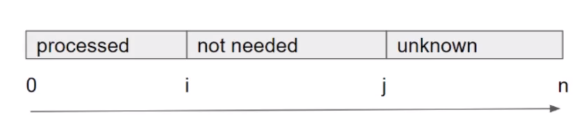
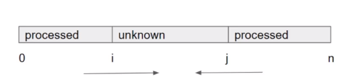

> 参考资料：
>
> [1] 九章算法
>
> [2] https://www.bilibili.com/video/BV1V54y1Q7bd?from=search&seid=1392124337789916292
>
> [3] https://www.youtube.com/watch?v=2wVjt3yhGwg
>
> [4] https://labuladong.gitbook.io/algo/suan-fa-si-wei-xi-lie/shuang-zhi-zhen-ji-qiao

# # 双指针概述

双指针可以用来解决**数组**、**字符串**、**链表**等数据结构的相关问题。

# 一. 链表和快慢指针

> [4]

## 1. 判断链表是否有环

快慢指针法

[141. 环形链表](https://leetcode-cn.com/problems/linked-list-cycle/)

```java
boolean hasCycle(ListNode head) {
    ListNode fast, slow;
    fast = slow = head;
    while (fast != null && fast.next != null) {
        fast = fast.next.next;
        slow = slow.next;

        if (fast == slow) return true;
    }
    return false;
}
```

## 2. 判断链表是否有环并返回环的入口位置

快慢指针法

[142. 环形链表 II](https://leetcode-cn.com/problems/linked-list-cycle-ii/)

[题解]([https://github.com/lvhlvh/leetcode/blob/master/src/main/java/Q142%E7%8E%AF%E5%BD%A2%E9%93%BE%E8%A1%A82/note.md](https://github.com/lvhlvh/leetcode/blob/master/src/main/java/Q142环形链表2/note.md))

代码如下：

```java
ListNode detectCycle(ListNode head) {
    ListNode fast, slow;
    fast = slow = head;
    while (fast != null && fast.next != null) {
        fast = fast.next.next;
        slow = slow.next;
        if (fast == slow) break;
    }
    // 上面的代码类似 hasCycle 函数
    slow = head;
    while (slow != fast) {
        fast = fast.next;
        slow = slow.next;
    }
    return slow;
}
```

(1) 先用1中的方法

## 3. 链表的中间节点

[876. 链表的中间结点](https://leetcode-cn.com/problems/middle-of-the-linked-list/)

快慢指针，快的走两步，慢的走一步

```java
class Solution {
    public ListNode middleNode(ListNode head) {
        ListNode fast, slow;
        fast = slow = head;
        while (fast != null && fast.next != null) {
            fast = fast.next.next;
            slow = slow.next;
        }
        return slow;
    }
}
```

## 4. 链表的倒数第k个节点

[剑指 Offer 22. 链表中倒数第k个节点](https://leetcode-cn.com/problems/lian-biao-zhong-dao-shu-di-kge-jie-dian-lcof/)

快慢指针，快的先走k步，然后快慢指针每次都走1步，当快指针为null时，慢指针就是倒数第k个。

```java
/**
 * 注意: k 可能大于链表长度
 */
public class Solution {
    public ListNode getKthFromEnd(ListNode head, int k) {
        ListNode fast, slow;
        fast = slow = head;

        while (fast != null && k-- > 0) fast = fast.next;
        // k > 0 则 fast 一定是 null, 说明k大于链表长度
        if (k > 0) return null;
        // fast和slow之间始终维持固定的间距，这也是双指针的用处之一
        while (fast != null) {
            fast = fast.next;
            slow = slow.next;
        }

        return slow;
    }
}
```

# 二. 数组双指针

对数组使用双指针算法时，很多情况下都对应​ :one: ​**数组有序**的情况。

## 1. 同向双指针



同向双指针算法中，两个指针分别是i, j。

i和j两个指针将数组划分为**3个区间**：

- [0, i) 处理过的元素
- [i, j) 不需要处理的的元素
- [j, array.length) 待处理的元素

:one:上述三个**区间的开闭**需要根据具体题目来决定，:two:但是需要**注意**：不论区间如何开闭，同一个元素不能有两个含义，例如上图中的i指针对应的元素，不能既代表processed，又代表not needed。

:three:用该算法处理过的数组，处理前后数组**元素的相对位置保持不变**。:star: 可以**根据这个特性来辅助判断使用同向双指针还是反向双指针**。​例如，在[Move Zeros](https://leetcode-cn.com/problems/move-zeroes/) 问题中，假设输入为`[0,1,0,3,12]`，则处理后的输出为`[1,3,12,0,0]`，而不会是`[3,12,1,0,0]`。

### 通用步骤

1.初始化两个指针`i`和`j`，通常初始化为`i = j = 0`

2.

```java
while (j < array.length) {
    if (array[j]符合条件) {
        array[i] = array[j];
        i++; j++;
    } else {
        j++;
    }
}
```

> 上述条件依据具体题目来确定，比如在[Move Zeros](https://leetcode-cn.com/problems/move-zeroes/) 问题中，上述条件就是`array[j] != 0`

### 例子

[Move Zeros](https://leetcode-cn.com/problems/move-zeroes/) 

## 2. 反向双指针



反向双指针算法中，两个指针分别是i, j。

i和j两个指针将数组划分为**3个区间**：

- [0, i) 和 (j, array.length) 处理过的元素
- [i, j] 待处理的元素

:one:上述三个**区间的开闭**需要根据具体题目来决定，:two:但是需要**注意**：不论区间如何开闭，同一个元素不能有两个含义，例如上图中的i指针对应的元素，不能既代表processed，又代表unknown。

:three:用该算法处理过的数组，处理前后数组**元素的相对位置<u>会发生变化</u>**。:star: 可以**根据这个特性来辅助判断使用同向双指针还是反向双指针**。

### 通用步骤

1.初始化两个指针`i`和`j`，通常初始化为`i = 0, j = array.length - 1`

2.

```java
while (i <= j) { // 或 i < j
    // (1) 根据array[i]和array[j]的值采取相应的操作，该操作可能是可能是交换两个元素、也可能是取其中比较小的值然后移动指针等等
    // (2) 每次循环至少移动一个指针，否则会造成死循环
}
```

### 例子

反转数组