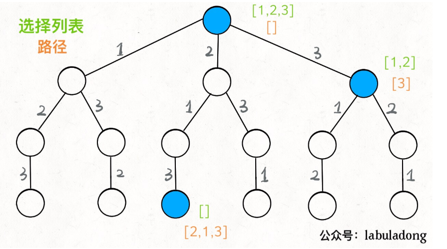
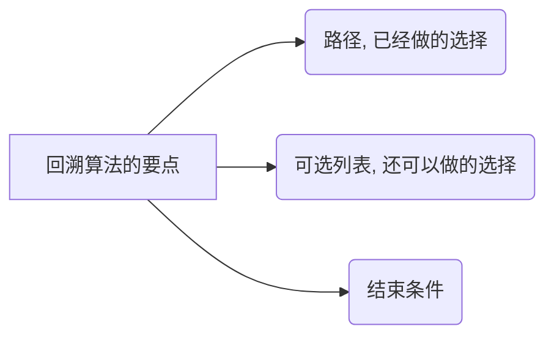

# 适用题型:star:

全排列、组合、generate all、print all、compute all

# 原理

回溯算法就是走一个“决策树”**做选择/决策的过程**, 每次做选择，都会缩小**决策空间**。

下图是**求[1, 2, 3]的全排列**的决策过程：



从图中可以看出，回溯算法有三个要点：



例如上述决策树图中，橘色代表已经做的选择，绿色代表还可以做的选择，结束的条件是已经做的选择数目达到了3个（也就是还可以做的选择为空）。

## 代码模板​ :star:

涉及的变量：

* 原始供选择数组 `arr`：例如求[1,2,3]的全排列，则`arr`为[1,2,3]
* 当前已经做的选择`choice`：例如在当前已经做的选择是[1,2]
* 记录`arr`中的数组是不是已经被访问过`visited`：对于求全排列问题，我们调用`backtrack`深入递归一层之后，不能选择之前已经选择过的元素

```java
result = new ArrayList<>();
visited = new boolean[arr.length];
void backtrack(arr，choice, visited, ...) {
    if (满足结束条件) {
        result.add(choice);
        return;
    }
    
    // 遍历每一个可供选择的元素
    for (int i = 0; i < arr.length; ++i) {
        if (visited[i]) continue;
        
        // 1. 做选择
        visited[i] = true;
        choice.add(arr[i]);
        
        // 2. Backtrack
        backtrack(arr, choice, visited, ...);
        
        // 3. 撤销选择
        choice.removeLast();
        visited[i] = false;
    }
}
```

其中，做选择和撤销选择的操作是**对称的**。

